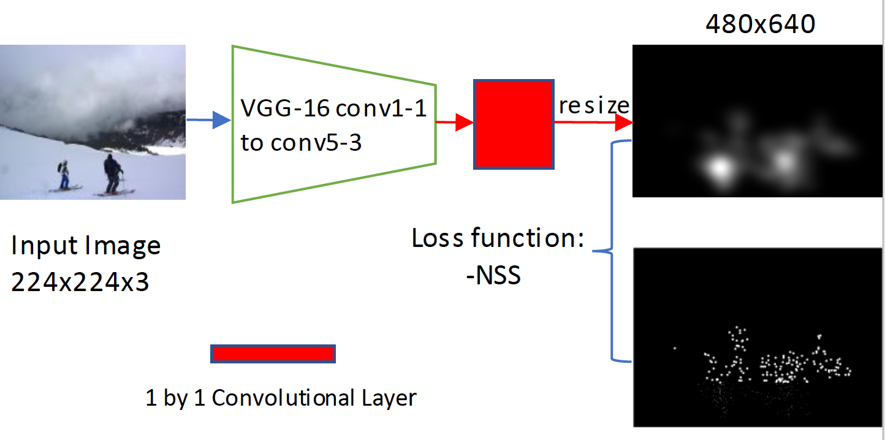
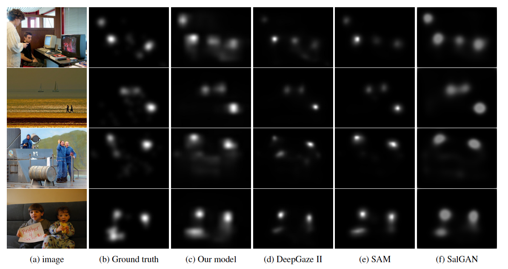
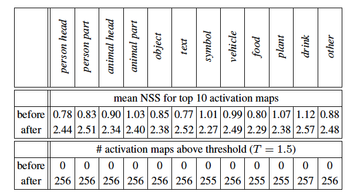
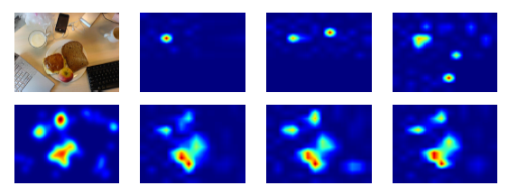

# Understanding-and-Visualizing-Deep-Visual-Saliency-Models-cvpr-2019
## Introduction
This is the demo of code, model and methods used in my CVPR 2019 paper ([link](https://arxiv.org/abs/1903.02501)).
There are some differences between the model used in the paper and this repository, the model used in the paper is implemented in Tensorflow and the model in this repository is implemented in Pytorch(0.4.1), if you are interested in this work, please run the demo.ipynb in jupyter notebbok to see the model and methods.
## The Model Architecture:

The model is trained on [Salicon database](http://salicon.net).  
Some saliency prediction examples on OSIE data  

## Data and annotation
### Data annotation
All the data annotation is done by myself using [labelme](https://github.com/wkentaro/labelme)
### Data link
[synthetic_data](https://drive.google.com/drive/folders/1wrdG1O5WgGl_ReoX5VGLKtroCuvzx2tv?usp=sharing)  
[OSIE-SR](https://drive.google.com/open?id=15iWBfNwktSq6KsNtAU1KRn0N3kVSOWHh)  
The SegmentationClass folder contains the semantic level masks for each salient regions in the image,and the SegmentationObject folder contains the instance level masks for each salient regions in the image.  
### Indexing in semantic mask
1:person head, 10:person part, 16:animal head, 22:animal part, 27:object, 37:text, 46:symbol, 51:vehicle, 57: food, 63:plant, 68:drink, 73:other
### Some data examples:  
  

## Representation in different backbones
Here we report the representation in different backbones (resnet-18) after fine-tuning  
  
Comparison of the activation map in vgg-16 and resnet-18 after fine-tuning, top row is the image and activation maps from vgg-16 after fine-tuning, bottom row is the groud truth saliency map and activation maps from resnet-18 after fine-tuning  

## training saliency prediction model
you need to first set up your own image path and the binary fixation map path in the code.
### in pytorch (preferred)
    python sal_train_pt.py
### in tensorflow
download the imagenet pretrained weight [here](https://drive.google.com/drive/u/0/folders/1IeBaSsJo-lcs6brKZt0mPfKXrKN6cYM0)

    python sal_train_tf.py

## Citation

    @inproceedings{he2019understanding,
        title={Understanding and Visualizing Deep Visual Saliency Models},
        author={He, Sen and Tavakoli, Hamed R and Borji, Ali and Mi, Yang and Pugeault, Nicolas},
        booktitle={Proceedings of the IEEE Conference on Computer Vision and Pattern Recognition},
        pages={10206--10215},
        year={2019}
    }
## Contact
<senhe752@gmail.com>
